# Corpus → Knowledge Engineering Pipeline

Convert a raw corpus (hundreds of books / TXT / EPUB / PDF / OCR files) into a structured knowledge system:

```
L0  RAW corpus (immutable — never edit originals)
L1  normalize: line endings → LF, one canonical text; record normalization.yaml
L2  segment: split into per-book sources (deterministic markers, not LLM guessing)
L3  chapter-map: per book, from the AUTHOR'S OWN ToC + page markers (deterministic first)
L4  book skills: agent follows a generation spec (e.g. book-to-skill SKILL.md) per source
L5  knowledge base / synthesis / router / decision skills (later stages)
```

The pipeline is proven at scale on a ~300-item / 800MB corpus; the worked method, the measured failure modes, and the evaluation protocols are documented here and in `references/`.

## Trigger

User wants to: turn local books/materials into AI skills; build a knowledge system for decision support; evaluate `book-to-skill` or similar converters; process Merged/multi-book TXT files; establish provenance for cross-author synthesis.

## Scope

Works on any **textual document corpus** (books, articles, merged TXT, EPUB/PDF text layers, OCR output). The guarantees are methodological, not format-bound:

- **Holds for any corpus**: the L0–L5 stages, the core principles (merged = multi-book collection, deterministic-first, provenance coordinates, three-layer claim typing, freeze baselines), the five-route structure-recovery strategy, decision-value routing, and the evaluation gates.
- **Corpus-specific — discover on first contact**: every concrete format (page markers, boundary markers, manifest headers, title patterns) is a property of the toolchain that produced the corpus. Script defaults match the corpus family they were built for; adapt per corpus (see the Page-marker formats note).
- **Material preconditions**: inputs must be convertible to text (scanned PDFs without an OCR layer, audio/video: out of scope); materials should have recoverable structure — structureless fragments route to evidence, never to skills (Completeness Gate).
- **Goal assumption**: the routing criteria (new decision primitive?) serve decision-support knowledge systems; for plain retrieval knowledge bases they still work as a "what deserves deep compilation" heuristic.
- **Not promised**: a format catalog, a compression ratio for your corpus (measured ratios are calibration priors from one large corpus), or auto-summarization.

## Core principles

1. **Merged document = multi-book collection.** Files like `Merged-A+B+C.txt` are books physically concatenated, each with its own ToC/page numbering. Segment by per-book markers (`【书名】` in one corpus, or `---`+title+`[PAGE 1/N]` signals) BEFORE anything else. Never feed a merged file to a converter as one "book".
2. **Deterministic first, LLM second.** The author's own ToC + page markers (`[PAGE N/M]` lines) are more trustworthy than any extractor's auto chapter detection. Build chapter maps from the document's own structure; use LLM only to fill gaps.
3. **Provenance coordinates** for every generated claim: `source_id → chapter_id → section_id → printed_page → ocr_page → line_range`. **Keep BOTH page numbers** — printed page (ToC value, human-readable, used in cross-book citations) and OCR page (`[PAGE N/M]` marker, machine-located). The offset between them is book-specific (see Pitfall 6). Line = normalized (LF) file line.
4. **Claim type is three-layer, never mixed:**
   - `source-derived` — author's text directly supports it (attach evidence coordinates)
   - `agent-derived` — compiler/agent inference; MUST `depends_on` ≥1 source-derived claim; never disguised as author's conclusion
   - `cross-source-derived` — multi-book combination inference; `depends_on` crosses `source_id`. This class is the seed of the future knowledge graph; register it in per-book claims.yaml but merge cross-book at the L5 synthesis layer.
   Rule: agent-derived claims never masquerade as the author's view; mark every Decision Use / cheatsheet line individually.
5. **Verify duplicates in the RAW file** (e.g. `grep -c` a distinctive title phrase in the original) before blaming the extractor. Merged files often contain summary + full text + duplicate editions — duplication is usually material-inherent.
6. **Normalized file is the line-number authority.** All line numbers refer to the normalized (LF) file, which matches grep/sed/wc view.
7. **Freeze after each benchmark.** Every validated book skill becomes a golden sample: a `<book>-v1-manifest.yaml` (validation record + known_limits + new capabilities) + a regression-baseline doc. Any compiler/pipeline change must re-run frozen samples and compare — only improvements allowed. Without freeze, later changes can't be attributed.

## Structure Recovery: five-route router

**Never** locate chapter titles by full-text grep alone — page headers repeat the chapter title on every page, subsection titles and body citations match before the real title does (measured: naive grep hit only 4/9 chapters on one book; page-anchor hit 9/9). Route per book's signals:

```
if explicit chapter markers in body      → chapter parser
elif ToC + reliable headings             → TOC anchor
elif ToC exists but body headings lost   → SEMANTIC anchor (grep key concept-definition
                                           sentences as content anchors; e.g. a concept
                                           triplet, a named fallacy — locate them, anchor
                                           chapters by them)
elif OCR/page markers                    → page-anchor recovery (below)
else (merged + no markers)               → boundary anchor (corpus's own boundary
                                           markers, e.g. 【】) + content grep
```

### Page-anchor method (the OCR/page-marker route)

```
1. Parse Contents/ToC for printed page numbers (join cross-line titles)
2. Verify OCR offset per book: ≥2 anchors (chapter title + page marker) → constant delta
   ⚠ offset differs per book (measured +10 and +12 in one corpus; any value possible);
   front-matter (roman-numbered pages) floats and cannot be used as anchors
3. printed_page + offset → page-marker line (deterministic anchor)
4. Read first ~8 lines of anchor page; find title (allow cross-line) → verify
5. Chapter end = next chapter anchor − 1
```

### Page-marker formats (observed states)

> The exact marker forms below are properties of the corpus family they were observed in (a Chinese-language merged corpus + archive.org scans) — a new corpus may have different markers or none at all. The durable method is: **any consistent, verifiable page signal can serve as an anchor**; verify it with ≥2 anchors, record the convention in the chapter map, and fall back to line-only provenance when no signal exists. The scripts' default marker patterns match this corpus family — pass `--marker` / adapt the pattern for other conventions.

| Format | Notes |
|---|---|
| `[PAGE N/M]` | printed + Δ, Δ book-specific, verify ≥2 anchors |
| `--- Page N ---` | **NO offset** — marker IS printed page |
| No markers | line-only provenance; boundary/content anchors |
| `[PAGE N/M]` with floats | merged files; front matter (roman) floats, body constant |
| `===== PDF PAGE N / TOTAL =====` | latex→txt; sequential page counter, NOT printed page — treat as line-region markers only |

### Body-title formats (observed states; tune per book)

`N. TITLE` (cross-line, dissertations); bare chapter-number line + title spanning 2–3 lines (no "Chapter" word); **ToC-only titles — body headings lost entirely** → semantic anchor; `N UPPERCASE TITLE` (Liberty Fund-style reprints); English-word chapter numbers + cross-line title (`Nine / <Title>` — regex needs a word list One/Nine/Twelve/Fourteen, not digits); `N Title` (digit + space + mixed-case title, no Chapter prefix); plus `CHAPTER N: TITLE`, `Chapter N - TITLE`, `Chapter N. Title`, `CHAPTER ONE` (OCR split words). Ready-made script: `scripts/page-anchor-chapter-map.py`.

## Pitfalls

1. **`\r\r\n` line endings (Windows tools).** Some extractors write double-CR lines (`\r\r\n`) even when the source is `\r\n`. Python text mode (universal newlines) then DOUBLES the line count (42k real lines → 85k via `split("\n")`), so python line numbers ≈ 2× grep line numbers and every line-based slice misaligns. **Fix:** read with binary / `open(newline='')` / `read_bytes()`, count `\n` vs `\r` to diagnose, normalize `\r\r\n → \n` once, then proceed.
2. **Extractor `chapters_detected` is noise** for merged/OCR corpora. Pollution sources: (a) ToC entries counted as chapters; (b) body citations/footnotes counted as titles; (c) duplicated content counted twice; (d) real titles missed (cross-line titles, OCR word splits, books whose body has no headings, academic formats). Rebuild chapter maps from the author's ToC + page markers. Use metadata only for stats (tokens/words/sources).
3. **Duplicate handling is a curation decision**, not string dedup. Flag as `suspected_duplicate` with occurrence count + locations + evidence; choose canonical at a curation gate; never delete inside the pipeline.
4. **OCR corpus title formats vary per book** (see format list under page-anchor method). Tune title-scan patterns per book.
5. **Large files:** 500K+ token corpora must be probed REPL-style (`grep -n` headings, `sed -n '<start>,<end>p'` slices), never read whole.
6. **OCR page numbers ≠ printed page numbers.** `[PAGE N/M]` marker values include front-matter pages that carry no printed number; the offset (OCR − printed) is constant within a book's body but differs BETWEEN books and even between sections of one merged file. Verify the offset with ≥2 anchors every time; record it in chapter-map `page_offset_note`; keep both numbers in provenance (Principle 3). Some editions use `--- Page N ---` with NO offset; some books have no page markers at all (line-only provenance).
7. **Bulk file writes can fail SILENTLY** (success reported, no output, files not created). When writing several artifacts at once, verify after (list the target dir) or write files one-by-one.
8. **Editorial introductions ≠ body.** Scholar's editions ship long editor introductions (version history, concept surveys) before the author's text. Claims citing the editor's introduction are NOT the author's voice — mark them as such (e.g. "editor's intro" in evidence) and distinguish from the body when compiling.
9. **YAML writes are lint-validated; three recurring YAMLErrors** (file NOT created on failure — fix content and retry): (a) comment lines starting with `>` parse as a block scalar — never start a comment line with `>`; (b) flow mappings `{...}` break on `;` or unquoted `:`/`,` inside values — use block-style indented fields for evidence dicts; (c) mixing a scalar into a list block — keep list bodies homogeneous.
10. **Multi-line python via `python -c "..."` fails on Windows/MSYS hosts** (newlines arrive as literal `\n` → `unexpected character after line continuation`). Write the script with write_file and run `python file.py` instead. Anything with for-loops needs a standalone script file (semicolons can't follow a colon in `-c` strings).
11. **Calibre `ebook-convert` picks its output plugin from the output EXTENSION.** Temp output named `<dst>.tmp.html` failed ALL epubs on Calibre 7.2 (`No plugin to handle output format: html`); use `.part.txt`. Corollary: smoke-test each channel with the SAME extension/params as the production run — testing one epub via a `.txt` temp hid this until full-scale.
12. **Manifest headers are corpus-specific — probe, don't assume.** Merged files often carry a header declaring their composition (observed in one Chinese-language corpus: `备注：本材料由以下 N 本书合并而成，内容顺序如下：1. T1 2. T2…` with each work starting at `【full title】`; THREE header formats coexisted even inside that corpus — numbered+markers, bare numbered list, and a `【文件说明】本文件由以下内容合并而来：- …` dash list). The exact convention is a property of the toolchain that produced the corpus, not of merged files in general — a new corpus may have none, one, or several. Treat it as a discovery task on first contact: probe the head region; locate the declaration ZONE (text before the first work-boundary marker AND before any standalone `---` separator — scanning deeper grabs numbered lists from BODY content and invents phantom books); bind markers to expected titles greedily ascending with longest-common-prefix ≥ min(10, len(key)); fuzzy-fallback locates unbound titles AFTER the last bound marker; when the filename names the set, trust it. Never hard-code one corpus's header format into the pipeline — re-probe when a new source family arrives.
13. **Filename ≠ content (batch rename accidents).** On a ~300-item corpus most files held DIFFERENT works than their names (long-range systematic shifts). Run a name-content check on EVERY file (normalized key from whole stem, junk/date prefixes stripped, ~32-char contiguous match in head 15k chars) — not just '+'‑named merge candidates; hidden merges hide behind innocent single-work names too (ToC-marker suspects were mostly false positives: normal Contents pages + prose "contents himself"). Resolution: REVERSE name matching — search every inventory filename-key inside the mismatched file's head; the name that appears IS the true identity (the majority auto-resolved; zero-candidate → caps-line heuristic → manual queue, never silently dropped). Filenames may be ABBREVIATIONS — never fuzzy-search an abbreviated name against full text. Same work in multiple files = different VERSIONS: process all, dedup is a curation decision only.

## Compiling book skills (9-section templates, two types)

Control variables across templates: provenance coordinates + claim classification stay identical.

- **Market-process type**: Core Thesis / Key Concepts / Frameworks / Competing Views / Implications / Decision Use / Limitations / Connections / Provenance
- **Organization-judgment type**: Core Thesis / Concept Map / Mechanism / Decision Procedure / Boundary Conditions / Failure Modes / Decision-Maker Translation / Provenance / Claim Classification

Budget: chapter ≤ ~2K tokens; draft-SKILL.md ≤ 4K tokens with `validated: false` in frontmatter. Drafts stay in a pilot dir, never installed to the real skill library until validated.

## Decision-value routing: what a corpus becomes

The goal is a **decision system, not a complete theory library**. Every material is routed to exactly one destination; rejection and stopping are NORMAL paths, not exceptions.

**Decision Value Score** (routing heuristic): +3 decision rules, +2 knowledge routing, +2 uncertainty handling, +2 strategic action, +1 historical context. Bands: ≤3 archive, 4–6 KB-only (no skill), ≥7 skill candidate. Compile gate: **score ≥8 AND new decision primitive AND not duplicate of existing skill**, else → evidence layer.

**Decision Value Class** (four-way verdict, supersedes raw score as the routing action):

- `primitive_candidate` → compile a skill
- `evidence_library` → register as evidence, each entry MUST map to a `primitive_id` (otherwise the evidence layer becomes an unindexed dump)
- `discard` → reject with logged reason (reject ≠ delete)
- `tool` → materials whose content is *formally invocable rules* (validity/consistency/deduction checks, statistical or financial calculators, legal-reasoning procedures) are NOT decision programs and NOT case evidence; they form a cross-cutting **Tool Layer** with its own boundary: input → check → output, they never answer or judge, they raise judgment quality. Keep tools OUT of the Knowledge layer or models will pollute it. Tool output format: named check-rules with runtime usage.

A reasoning pattern that is *cross-cutting* (e.g. an unseen-consequences check — "look at longer effects and all groups") is not a new primitive just because no existing skill covers it verbatim: it doesn't answer who-decides / when-to-call / how-to-act, so it extends existing primitives as an evidence layer instead.

### Skill Merge Test (anti-explosion)

Ask whether the new book adds a NEW *decision primitive* (independent judgment-rule family), not merely new viewpoints. Same-author books merge into one family. Novelty score: 0=duplicate / 1=example-only / 2=extension (family action-space growth) / 3=new judgment procedure. Measured compression on a real corpus: ~10:1 — hundreds of items project to a small set of skills and primitives, landing at the low end in practice. Track in a skill-landscape doc.

**Primitive registry is the Merge Test's frame of reference** — "new primitive" is only meaningful relative to the registered primitives. Maintain `primitive-registry.yaml` (id / decision_question / sources / key_claims / decision_procedure / novelty_notes / merge_rules) and a `merge-decision-log.md` (every book's merge verdict + rationale) BEFORE running merge tests.

### Registry stability + drift policy

Institutionalize the answer to "every book feels like a new discovery → degenerate into a book-summary library":

- **Registry Drift Rate** = primitive/dimension changes ÷ books processed (targets: <5% early, <3% mid, <1% at full scale). The asset being protected is the decision-OS map's stability, not skill count.
- **Allowed registry changes** (all must hold): new runtime failure surfaced by a case / existing primitive cannot explain a material / ≥2 INDEPENDENT sources repeat the same gap (never a single author).
- **Forbidden**: new book has new terminology / author's own named concept / more examples / changed marketing packaging.
- **Dimension upgrade ≠ drift**: upgrades are controlled evolution (novelty=2 merges with allowed-condition evidence); drift = forced primitive changes.
- **Stop Condition** (anti-expansion last line): every material may STOP and never become a system asset — information insufficient / already covered (novelty ≤1) / examples only / maintenance cost > judgment benefit.
- **Production Exit Criteria**: a book is DONE when chapter-map + decision-value-class + primitive impact + merge decision + manifest are all recorded (never "when read").

## Production SOP

Run the pipeline as a **state machine**, not a linear checklist. Two forms, both verified:

### Finite-automaton form

The SOP's formal five-tuple definition (Σ/Q/δ/q0/F + global guards + modes):

```mermaid
stateDiagram-v2
    direction LR
    [*] --> MATERIAL : corpus item
    MATERIAL --> COMPLETENESS : input
    COMPLETENESS --> STRUCTURE : complete / partial
    COMPLETENESS --> REJECT : incomplete (>20% missing)
    COMPLETENESS --> RUNTIME : fragment (no ToC/body)
    STRUCTURE --> CLASSIFY : chapter-map recovered
    CLASSIFY --> SKILL : new primitive, score ≥8
    CLASSIFY --> MERGE : family hit, novelty ≤2
    CLASSIFY --> RUNTIME : checklist / procedural
    CLASSIFY --> TOOL : invocable rules
    CLASSIFY --> STOP : already covered (novelty ≤1) / examples only
    CLASSIFY --> REVIEW : vector uncertain
    REVIEW --> CLASSIFY : LLM confirms
    MERGE --> FREEZE : merged + manifest
    RUNTIME --> EVIDENCE : primitive_id mapped
    RUNTIME --> STOP : unmapped (human arbitration)
    SKILL --> [*]
    EVIDENCE --> [*]
    TOOL --> [*]
    FREEZE --> [*]
    REJECT --> [*]
    STOP --> [*]
    note right of MATERIAL
        global guard: stop_condition (info insufficient /
        already covered / examples only / maintenance cost)
        may fire from ANY state → STOP
    end note
```



Machine-readable form: `templates/production-sop-automaton.yaml`.

- **6 terminal states**: FREEZE / SKILL / EVIDENCE / TOOL / REJECT / STOP — rejection and stopping are NORMAL paths.
- **Branching paths, not a fixed sequence**: completeness=incomplete → REJECT directly (never runs structure recovery); fragment → evidence path (via RUNTIME mapping, no structure recovery); every evidence entry passes RUNTIME (primitive_id mapping check; unmapped → STOP for human arbitration) to avoid an unindexed dump.
- **Global guard**: stop_condition can fire from ANY state → STOP.
- **3 modes**: full / analyze-only / fold-in — same automaton, different terminal expectations.
- **Determinism**: each (state, signal) → exactly one transition (DFA property); historical samples can be replayed to verify paths.

### Vector-machine form

"LLM as sensor, computation as controller" — replace semantic guards with vector thresholds:

- **Feature vector per material (13 components)**: 10 computable without LLM — f_type / f_words (CJK-adjusted: `len(text.split()) + int(cjk_chars / 1.5)` — Chinese has no spaces, plain split() misjudges Chinese books as incomplete) / f_garbage (special-chars/total — **only after textify**, never on binary) / f_page_ratio / f_chapter_hits (body region only — exclude the first ~10% of the file where the ToC lives) / f_toc / f_biblio / f_boundaries (boundary-marker count for merged — the corpus's own convention, e.g. 【】) / f_family_hit (normalize filename first — `_`/`-` → space; merged filenames: match the segment before the first `+`) / f_festschrift (journal/reader/essays-in-honor markers) — plus 3 LLM-generated: f_novelty (Merge Test 0–3), f_score (Decision Value Score), f_runtime_gain (strategic guard).
- **Threshold decision tree** replaces semantic guards: garbage>0.3 → REJECT; toc+biblio present but no body chapter hits → REJECT (incomplete); small words + no toc + no family hit → REVIEW (LLM confirms; toolbooks are small — NOT direct fragment); festschrift/journal → ARCHIVE; family hit → MERGE candidate (LLM confirms novelty ≤2 + merge_target).
- **Replay = regression test set**: historical judgments become the regression corpus; every SOP change replays all of them. Vector prediction ≠ historical verdict → **flag for human recheck, NEVER auto-overwrite** (the human decides whether the vector or the history is wrong).
- **Textify-before-featurize**: epub/pdf must be unpacked before any garbage/structural metrics — a binary read as text produced a false 64.8% "garbage" REJECT verdict (the unpacked book was 0.68% garbage and a normal merge candidate).
- Human-cost model: vector pre-classification + 3 LLM components ≈ <1 min/book; the LLM's per-item work shrinks to confirming 3 numbers.

Full design: `references/vector-machine-sop.md`.

## Evaluation gates

### Completeness Gate (input validation, before curation)

Some corpus files look like complete books but contain ONLY front matter + ToC + bibliography — body chapters missing. Risk: LLM completes the missing text → a beautiful skill with fabricated basis → provenance poisoned. Check signals: S1 body-anchor missing (ToC titles absent from body region), S2 size-ratio anomaly (words ≪ expected; front+ToC+bib ≈ 1/4–1/3 of a book), S3 structural termination (file ends in bibliography/index), S4 citation integrity ("see Chapter N" with no such chapter). Grades: complete / partial (missing <20% → proceed with gap marked; >20% → reject) / incomplete (REJECT `insufficient source body`) / fragment (no ToC no body → evidence-eval, not skill compile). **When a coverage test hits an incomplete file, do NOT abandon the test** — downgrade to concept-level verdict from the front matter (prefaces carry core concepts), cross-verify with alternate sources in the corpus, and record the material defect as a pipeline data point. Rejection policy: reject ≠ delete (log every verdict); reject BEFORE generate when uncertain (LLM-completion is the failure mode); source-derived evidence is the provenance floor.

### Dirty-sample test (Compilation Safety)

Before production, verify the compiler does NOT hallucinate on bad input ("does the system know when NOT to compile?"). Key findings from a 3-sample run:

- **(a) "ocr"/"scan" in filenames is a WEAK signal** — measured garbage_ratio across named-ocr files was all <1% (0.5–0.8%); judge quantitatively (garbage_ratio / page_marker_integrity / chapter_anchor_hits), never by naming heuristic, or you over-reject ~20 usable OCR files in a 300-item corpus. Noise metrics: garbage_ratio (special chars/total; <0.01 low, 0.01–0.02 medium, >0.02 high risk), page-marker integrity (markers vs expected pages; >20% missing → structural risk), header/footer repeat, chapter-anchor hits (0 → semantic anchor needed).
- **(b) archive.org scans are a special case**: `--- Page N ---` markers with front pages missing (observed starting at page 4) → front-matter completeness check.
- **(c) Merged auto-split is rule-able**: corpus boundary markers (【】 in one corpus) + file-header order note → boundary-anchor → per-book routing, no manual work.

Decision matrix: body missing → Reject; structure uncertain (0 chapter hits + missing pages) → **Partial** (semantic-anchor recovery before proceed); duplicates undecidable → Evidence only; provenance lost → forbid skill; good OCR (garbage<1% + complete markers) → Proceed. Real reject rate estimate for a ~300-item corpus: <5%.

### Coverage tests (new-primitive detection)

Before full scale-out, run 2–3 targeted "coverage tests" on materials that might either create a NEW decision primitive or extend an existing one. Primitive-detection questions (generalize for any candidate source):

- **Q1 — independent decision question?** Does the material answer a decision question no existing primitive answers (≠ "what challenge" / ≠ "who judges" / ≠ "what do customers need")?
- **Q2 — independent runtime action?** Are there concrete actions producible ONLY from this material — not re-runnable by existing primitives?
- **Q3 — already covered?** Map the material's domains onto existing primitives; the empty cell is its candidate space.

**Verdict rule (durable):** dimension-merge wins when the decision DOMAIN still belongs to an existing primitive, even when Q1/Q2 partially pass — domain ownership is the tiebreaker. Verdicts recorded: institutional constraints → dimension upgrade of knowledge-distribution (no new primitive); capital/time structure → time-structure dimension merged into diagnosis-first ("does it introduce a new decision variable?" — the intertemporal triad **now-sacrifice ↔ future-release ↔ path-reversibility**; not "is it commitment?" — commitment is an action attribute, intertemporal capital structure is the decision OBJECT); technical capability → capability-boundary dimension merged into authority-assignment ("what can our organization actually execute?"). All three were novelty=2 merges; the ontology held.

### Runtime field-coverage audit

When a knowledge gap is suspected, first audit existing runtime cases against the memo template — a cases × fields matrix showing which fields are covered (✅ explicit / ◐ implicit / — missing). A suspected theory gap that shows up as an EXECUTION gap (sub-fields unused, logs never backfilled, triggers never made explicit) is not a theory gap — fix the discipline, not the registry. Only fields with 0 independent coverage across cases justify a new coverage test.

## Publishing compiled skills

### Install into your agent harness

- Copy the whole skill directory into the harness's skills root, keeping `chapters/` + glossary/patterns/cheatsheet subfiles — SKILL.md links to them relatively and they load on demand.
- ⚠ **Some generators output `draft-SKILL.md`; most harnesses only recognize `SKILL.md`.** Rename after copying or the skill silently never loads. Frontmatter must carry `name` + `description` — validate on the FIRST skill before bulk-copying the rest.
- Verify per skill by loading it by name and checking readiness — directory presence alone proves nothing.
- Mirror the installable content (SKILL.md + claims.yaml + chapters/) into a dedicated archive dir so the installed artifacts stay recoverable and reviewable apart from the pilot tree.

### book-to-skill integration (extractor + spec, virgiliojr94/book-to-skill, MIT)

- **It's a compiler, not a skill library**: root `SKILL.md` is the *generation spec* (Steps 0–10; modes: Full / Analyze-only / Generate-from-analysis / Fold-in); `book_to_skill/` Python package is the deterministic extractor; the generator step is done by an agent following the spec.
- Run extractor locally: `python -m book_to_skill <paths> --mode text --no-install-missing` (system python with pip). TXT/MD/rST are native (zero deps); EPUB needs `ebooklib beautifulsoup4`; PDF needs `pypdf pdfminer.six`. EPUB alternative with zero deps: it's a zip — unzip → strip HTML tags → clean text (`scripts/epub-to-text.py`); extracted EPUB has NO page markers → line-only provenance, and footnotes interleave in the body (tag citations body-vs-footnote). Output: `<tempdir>/book_skill_work/full_text.txt` + `metadata.json`.
- Execute the generator steps yourself: adapt the skill home to your skills dir (or a project dir), replace ask-steps with user confirmations, keep the REPL probes. Generated skill layout (SKILL.md with `name`+`description` frontmatter + `chapters/` + glossary/patterns/cheatsheet) is harness-compatible; chapters load on demand like references.
- Never trust its auto chapter detection on merged/OCR corpora (see pitfalls) — use it only for text extraction; rebuild structure from the author's ToC.
- Evaluation-first adoption: download candidate repos to a workspace `refs/` dir for evaluation instead of installing (user decides); present source + per-candidate assessment + rejection reasons before any install.

### Public release standards

When compiled skills leave the local machine as a PUBLISHED artifact, apply these verified standards:

- **Two-tier provenance.** Internal install/mirror KEEPS line-number coordinates + `validation:` blocks (anti-fabrication floor). Public release STRIPS them: evidence = author + book title only (line numbers point at local OCR files — externally unverifiable AND they leak the corpus layout); self-reported validation records are deleted outright; OCR details (offset notes, "LF-normalized"), internal case IDs, and pipeline terms are deleted too.
- **Item-by-item processing, no script-batch modification.** Present the complete old→new change table grouped by category (evidence rewrites / path removals / internal-term deletions / validation deletions), get ONE confirmation for the table, then patch item-by-item (one edit per change, never regex sweeps); read-only verification scans are allowed as CHECKING.
- **Language unification + terminology table.** Published content is unified English. Build a term table FIRST with tri-state marking: `standard term` (discipline-wide) / `author-specific term` (kept verbatim — do not translate terms that differ in meaning) / `framework-specific term` (defined at first use). Cross-check external AI feedback against source texts before adopting its reclassifications.
- **Copyright gate on chapters/.** Whole-chapter compilation files containing extensive verbatim excerpts are substantive reproduction of in-copyright books → EXCLUDE from the public release. Short quotes in claims/SKILL.md stay (fair use); glossary/patterns/cheatsheet are derivative work → keep. `chapters/` survives only in the internal/source tree.
- **Umbrella merge mechanics** (when multiple skills merge into one): entry `SKILL.md` = routing table + judgment chain + terminology + provenance; merged `claims.yaml`; per-protocol detail under `references/protocols/<name>.md`. Merge pitfalls: ID collisions across skills (rename one and update EVERY reference), dangling depends_on (drop), cross-source ID unification.

### Post-compile audit (publishability + coverage — review class)

When asked "is this skill publishable / does it leak local info" or "did the skill fully absorb the corpus", run a two-part audit BEFORE touching anything:

- **Audit A (privacy/publishability scan)**: grep patterns for local paths (`[A-Za-z]:[\\/]`, `/c/Users`, `C:\Users`), usernames/AppData/.ssh, credentials (token/password/api key/private-key blocks), internal addresses, and workflow artifacts (PROJECT-LOG/PROJECT-CONTEXT/AGENTS/tasks/`.hermes`/HANDOFF — search case-insensitively, default grep is case-sensitive); hidden-file check via `ls -la`. Pitfalls: theory terms false-positive credential regexes (e.g. a "secrets" concept hits `secret` — verify each hit's context, report the line not the regex); recount statistics yourself before reporting count mismatches. Report security findings as a table, separated from functional defects (broken links, stale notes).
- **Audit B (coverage completeness vs source corpus)**: NEVER read the huge corpus files — verify with metadata + targeted greps: (1) purpose-relative verdict from the skill's own README (a judgment protocol ≠ a knowledge base; coverage standard = the sources it CLAIMS, not the whole corpus); (2) locate each claimed source in the corpus; (3) `grep -o -i "<key term>" <file> | wc -l` presence probes prove the claim basis exists; (4) claim-count cross-check (umbrella total = Σ component skills' claims; ID prefixes + depends_on resolution); (5) decision-log archaeology — partial retention is DESIGNED compression when logged, not truncation; (6) timestamp staleness — summary logs go stale, prefer artifacts + decision logs and FLAG record contradictions. Report intentional compression and genuine gaps separately.

Full patterns: `references/post-compile-audit.md`.

## Downstream: compiled skills as a decision system

Once 2+ validated skills exist, the runtime link is: skills → decision agent (a workflow spec + memo template, not code). The compiled skills answer a four-question kernel:

```
Where is the knowledge?     → dispersed-knowledge claims
Who owns judgment?          → original/derived judgment claims
What is the real challenge? → strategy-kernel claims
What action follows?        → consumer-sovereignty + action claims
```

Decision classification: `puzzle` (known rules → direct analysis) / `case_probability` (unique, needs experience → expert routing) / `mystery` (radical uncertainty → hypothesis tree + experiments). Judgment assignment distinguishes original judgment (owner) from derived judgment (technical owner), with anti-overreach in both directions. Decision memos carry a Dissent section (bear case / kill criteria defined ex-ante / hidden assumptions / who would know) and a final Human-decision line (owner + the non-delegable question).

## Support files

- `references/vector-machine-sop.md` — SOP v3 vector machine: 13-component feature vector (10 computable + 3 LLM), threshold decision tree, replay-as-regression mechanism (inconsistency → human recheck, never auto-overwrite), the binary-read-as-text false-positive catch (textify-before-featurize), and the cost model.
- `references/window-claims-decomposition.md` — post-segmentation window→claims decomposition stage: subagent batches turn windowed source slices into append-only claims JSONL + done flags; conventions to infer from siblings first, verbatim quote matching (clean + find with slice-not-type anchors), turn-integrity discipline, closeout verification.
- `references/dirty-sample-and-test-c.md` — Compilation Safety protocol: noise metrics, decision matrix, archive.org special case, merged auto-split rule, "ocr naming is a weak signal" — plus the Coverage Test C primitive-detection questions (Q1/Q2/Q3) and the dimension-merge verdict rule.
- `references/coverage-tests.md` — Coverage Test A (institutional constraints → dimension upgrade) and Test B (capital/time structure → dimension merge) with the completeness-gate trigger case; the "new decision variable" question; phase-freeze manifest pattern.
- `references/post-compile-audit.md` — two-part audit: privacy-scan pattern list + false-positive rules, coverage audit via grep term counts, claim-count cross-check, and the honest-gap report shape.
- `references/public-release-and-umbrella-merge.md` — publication phase: privacy-audit categories, two-tier provenance policy, validation-record deletion, terminology tri-state table, copyright gate on chapters/, umbrella merge mechanics (ID collision / dangling depends_on / cross-source ID unification).
- `references/external-candidate-evaluation.md` — external-candidate INTEGRATION-TEST toolkit: codeload tarball download loop, circular-import workaround, pip `--target` isolation, bypassing heavy report layers, the "opposite direction" trap.
- `references/rehearsal-protocol.md` — production-rehearsal run data: format-difficulty spread, page-marker & body-title format states, Decision Value Score application, skill-merge verdicts, cost model.
- `templates/chapter-map.yaml` — deterministic chapter-map skeleton (ToC pages + page-marker line mapping).
- `templates/production-sop-automaton.yaml` — the production SOP as a DFA five-tuple: states / alphabet / transitions / terminals / global guards / modes (machine-readable companion to the mermaid diagram above).
- `scripts/structure-scan.py` — multi-pattern chapter-title scanner (per-book format tuning; prints hits with line numbers).
- `scripts/page-anchor-chapter-map.py` — page-anchor chapter-map builder: Contents printed pages + verified OCR offset → `[PAGE N/M]` anchors → chapter spans.
- `scripts/epub-to-text.py` — dependency-free EPUB → text (zip → HTML strip; stdlib only; line-only provenance; body-vs-footnote caution).
- `scripts/pdf-to-text.py` — PyMuPDF PDF → text (install with `python -m pip install pymupdf`; text-only PDFs; scanned PDFs need OCR instead).
- `scripts/pdf-extract-chunked.py` — standalone chunked PDF extractor (20-page slices + retry + timeout). Use instead of inline extraction — whole-doc extraction dies on 100+ page PDFs.
- `scripts/window-claims-helpers.py` — copy-ready helper module for post-segmentation window→claims decomposition: clean()/slice_sentence()/next_n() (cross-file collision-free numbering)/append_records()/spec() with trim_to/end_at/extend_to quote guards.
